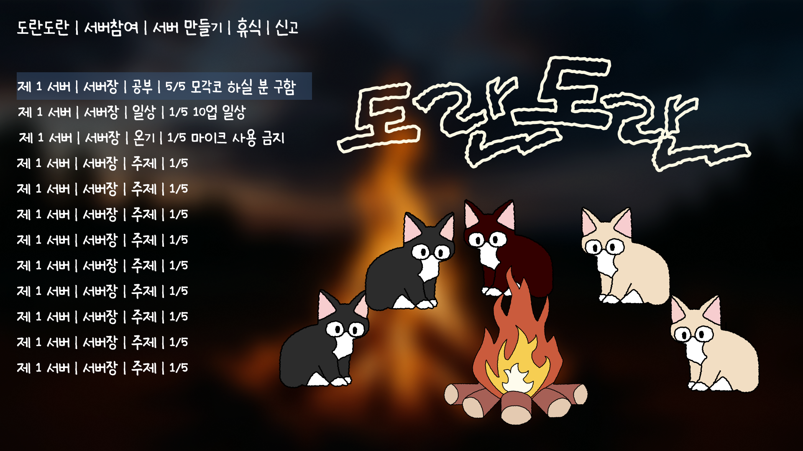
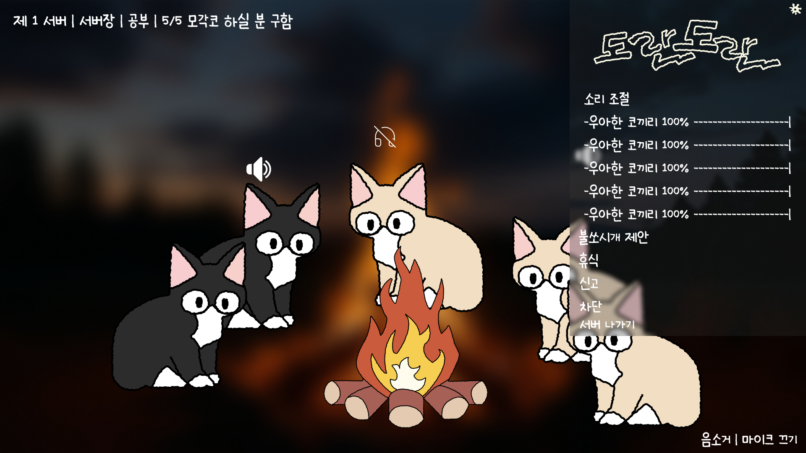
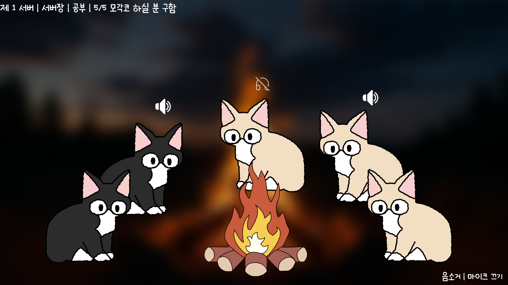
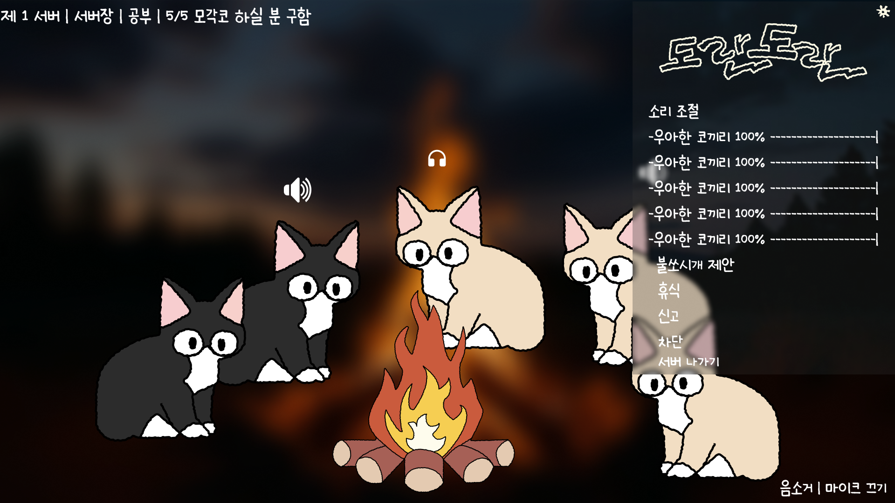
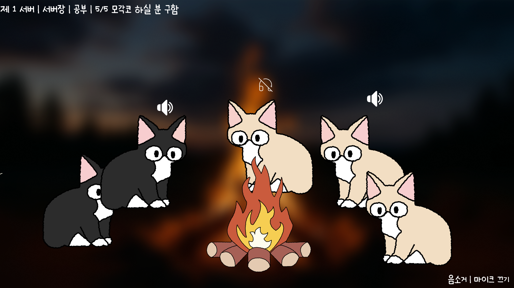

# 도란도란

> 모닥불 앞에 모인 고양이들과 편하게 대화하는 감성 음성 커뮤니티 서비스 프로토타입


| 항목 | 내용 |
| --- | --- |
| 프로젝트명 | 도란도란 (DoranDoran) |
| 제작 기간 | 2026.07.21 ~ 2026.07.22 |
| 제작 인원 | 1명 |
| 배포 URL | [https://uhpark0524.github.io/dorandoran/](https://uhpark0524.github.io/dorandoran/) |
| 디자인 | Figma `2026 점프업` Section 3 기반 |

## 프로젝트 소개

**도란도란**은 모닥불, 고양이, 손글씨 폰트를 활용해 부담 없이 대화를 시작할 수 있도록 만든 음성 커뮤니티 서비스입니다. 서버에 참여한 뒤 같은 모닥불 앞에 모인 사람들과 대화한다는 흐름을 화면으로 표현했습니다.

### 만든 목적

- 음성 채팅의 기능은 유지하면서도 차갑고 복잡한 인터페이스 대신 편안한 분위기를 만들고자 했습니다.
- 사용자가 서버 참여부터 대화방 진입, 멤버 관리까지의 흐름을 직관적으로 이해할 수 있는 인터랙티브 프로토타입을 구현했습니다.

### 주요 사용자층

- 친구, 동아리, 소규모 스터디처럼 편하게 음성으로 소통하고 싶은 사용자
- 감성적인 캐릭터·일러스트 기반 커뮤니티 경험을 선호하는 사용자

## 사용 기술

| 구분 | 기술 |
| --- | --- |
| 화면 구성 | HTML5, CSS3 |
| 인터랙션 | Vanilla JavaScript |
| 반응형·접근성 | CSS Media Query, `prefers-reduced-motion`, 키보드 포커스 스타일 |
| 디자인·에셋 | Figma, SVG/PNG 에셋, 온글잎 의연체 |
| 배포 | GitHub Pages |
| 버전 관리 | Git, GitHub |

## AI 활용 및 검토 과정

### 사용한 AI

- **OpenAI Codex**: Figma 화면을 웹 프로토타입으로 옮기고, 공통 인터랙션과 문서를 구현하는 데 활용했습니다.

### AI에게 맡긴 작업

- Figma 시안을 기준으로 한 6개 화면의 HTML/CSS 구조 작성
- 서버 참여·서버 목록·멤버/서버장 화면 이동 연결
- 음소거, 마이크, 신고, 차단, 서버 나가기, 음량 조절 등의 인터랙션 구현
- 공통 설정 버튼, 토스트 메시지, 확인 모달, 호버 효과, 반응형 스타일 작성
- README 초안 작성 및 배포 파일 구성

### 직접 수정 및 개선한 내용

- 온글잎 폰트와 사용자가 제공한 음소거 아이콘으로 교체
- Figma 시안과 맞지 않는 겹침, 간격, 메뉴·음량 패널 표현을 반복 검토
- 모든 화면에서 설정과 멤버 식별이 가능하도록 흐름과 라벨을 조정
- 실제 `<input type="range">`를 사용해 음량을 직접 조절할 수 있도록 개선
- AI가 만든 결과를 바로 사용하지 않고, 캡처 화면을 확인하며 위치·문구·동작을 수정

## 주요 화면 및 구현 내용

### 화면 흐름

```text
메인 → 서버 목록 → 팀원 화면 → 팀원 메뉴
  └→ 서버 만들기 → 서버장 화면 → 서버장 메뉴

서버 나가기 → index.html → 메인
```

| 화면 | 스크린샷 | 구현 내용 |
| --- | --- | --- |
| 메인 |  | 서버 참여·서버 만들기 진입, 설정 버튼, 모닥불 불똥 효과 |
| 서버 목록 |  | 서버 선택 후 팀원 화면으로 이동 |
| 팀원 메뉴 |  | 신고·차단·서버 나가기, 개별 음량 조절 |
| 팀원 화면 |  | 고양이별 닉네임 표시, 음소거·마이크 상태 알림 |
| 서버장 메뉴 |  | 서버장 권한 화면의 메뉴·음량 제어 |
| 서버장 화면 |  | 서버 생성 후 관리 화면, 공통 설정 진입 |

### 인터랙션

- **서버 참여**: 메인에서 서버 목록으로 이동하고, 서버를 선택하면 팀원 화면으로 진입합니다.
- **설정**: 모든 화면 오른쪽 상단의 설정 버튼으로 서버장 메뉴에 접근합니다.
- **음소거·마이크**: 버튼을 누르면 현재 상태에 맞는 토스트 메시지가 표시됩니다.
- **신고·차단**: 확인 모달을 통해 한 번 더 의사를 묻고 결과를 알려 줍니다.
- **서버 나가기**: `index.html`을 거쳐 메인 화면으로 돌아갑니다.
- **개별 음량 조절**: 다섯 멤버의 슬라이더를 움직이면 각 퍼센트가 즉시 바뀝니다.
- **호버·반응형**: 클릭 가능한 영역은 마우스 오버 시 강조되며, 화면 크기에 따라 16:9 디자인 비율과 모바일 조작 영역을 유지합니다.

## 어려웠던 점과 해결 방법

### 1. Figma 시안의 분위기를 웹에서도 유지하기

| 어려웠던 점 | 해결 방법 |
| --- | --- |
| 일러스트, 글자, 배경이 한 화면에서 겹치는 감성 시안 | Figma 원본 화면을 기준 이미지로 사용하고 SVG·폰트·효과 레이어를 분리해 필요한 인터랙션만 덧붙였습니다. |
| 화면마다 같은 기능을 넣으면 코드가 중복되는 문제 | `navigation.js`에 공통 버튼, 모달, 토스트, 음량 UI를 모아 모든 화면에서 재사용했습니다. |
| 작은 화면에서 조작 영역이 너무 작아지는 문제 | `svh`, Media Query, 최소 터치 영역을 적용해 모바일에서도 설정·모달·버튼을 누르기 쉽게 조정했습니다. |
| 정적 시안에 동적인 느낌을 더하는 문제 | 모닥불 밝기 변화와 불똥 애니메이션을 추가하고, 모션 감소 환경에서는 애니메이션을 끌 수 있게 했습니다. |

## 프로젝트 회고

이번 프로젝트를 통해 예쁜 시안을 웹으로 옮길 때는 단순히 이미지를 배치하는 것보다, 사용자가 실제로 어떤 순서로 누르고 어떤 피드백을 받는지까지 설계해야 한다는 점을 배웠습니다. 특히 음소거, 신고, 차단처럼 사용자의 행동 결과가 중요한 기능에는 즉각적인 메시지와 확인 단계가 필요했습니다.

또한 AI를 활용하면 화면 뼈대와 반복 코드를 빠르게 만들 수 있지만, 결과물이 디자인 의도와 맞는지는 사람이 직접 캡처를 비교하며 검토해야 한다는 점을 확인했습니다.

### 프로젝트를 통해 배운 점

- Figma 시안을 구현할 때는 **화면 전환 흐름**과 **상태 피드백**을 함께 설계해야 합니다.
- 공통 기능을 한 JavaScript 파일로 관리하면 여러 화면의 동작을 일관되게 유지할 수 있습니다.
- 반응형 구현에서는 단순 축소보다 터치 영역, 모달 크기, 텍스트 가독성을 함께 고려해야 합니다.
- AI 결과물은 초안으로 활용하고, 시각 비교와 사용성 검토를 통해 개선해야 합니다.

### 다음 프로젝트에서 개선할 점

- 현재 프로토타입의 화면 상태를 실제 데이터 구조와 연결해 서버·멤버 정보를 동적으로 관리하기
- 음성 채팅, 로그인, 서버 생성 기능을 실제 백엔드와 연동하기
- 화면을 이미지 기반에서 컴포넌트 기반 UI로 더 세분화해 다양한 기기와 상태에 유연하게 대응하기
- 실제 사용자 테스트를 진행해 메뉴 위치, 알림 문구, 음량 조절 경험을 개선하기

---

문의 또는 피드백은 [GitHub 저장소](https://github.com/uhpark0524/dorandoran)에서 확인할 수 있습니다.
